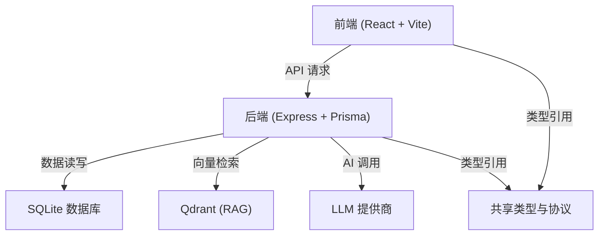

# AI 小说创作工作台 Code Wiki

## 1. 项目概览

AI 小说创作工作台是一个面向长篇小说创作的 AI Native 开源项目，旨在帮助用户从一个想法出发，自动构建世界观、人物、剧情结构，管理知识与设定（RAG），控制写作风格与叙事一致性，最终生成完整章节甚至整本小说。

### 核心功能
- AI 自动导演开书：从一句模糊灵感直接进入自动导演，生成多套整本方向和对应标题组
- Creative Hub 与 Agent Runtime：统一创作中枢，支持对话、追问、规划、工具调用、执行状态和回合总结
- 整本生产主链：从结构化规划、章节目录和资产准备状态出发，启动整本写作任务
- 写法引擎：管理写法资产、风格约束和反 AI 规则
- 世界观、角色、拆书、知识库联动：支持创建、分层设定、快照、深化问答、一致性检查和小说绑定
- 模型路由与本地运行：支持 OpenAI、DeepSeek、SiliconFlow、xAI 等多提供商配置

### 技术栈
| 层级 | 技术 |
| --- | --- |
| 前端 | React 19、Vite、React Router、TanStack Query、Plate |
| 后端 | Express 5、Prisma、Zod |
| AI 编排 | LangChain、LangGraph |
| 数据库 | SQLite |
| RAG | Qdrant |
| 工程形态 | pnpm workspace Monorepo |

## 2. 项目架构

### 2.1 整体架构

项目采用 Monorepo 结构，分为前端（client）、后端（server）和共享（shared）三个主要部分。前端负责用户界面和交互，后端负责业务逻辑和 AI 编排，共享部分包含前后端共用的类型和协议。



### 2.2 目录结构

```
client/   # React + Vite 前端
  src/
    api/         # API 客户端
    components/  # 组件
    hooks/       # 自定义钩子
    lib/         # 工具库
    pages/       # 页面
    router/      # 路由
    store/       # 状态管理
    types/       # 类型定义

server/   # Express + Prisma + Agent Runtime + Creative Hub
  src/
    agents/      # AI 代理
    chains/      # 链
    config/      # 配置
    creativeHub/ # 创作中枢
    db/          # 数据库
    events/      # 事件
    graphs/      # 图
    llm/         # LLM 相关
    middleware/  # 中间件
    prompting/   # 提示词
    routes/      # 路由
    services/    # 服务

shared/   # 前后端共享类型与协议
images/   # README 与产品预览截图
scripts/  # 启动和辅助脚本
docs/     # 设计文档、阶段检查点、模块计划与历史归档
```

## 3. 核心模块

### 3.1 前端模块

#### 3.1.1 页面结构

前端采用 React Router 进行路由管理，主要页面包括：

| 页面 | 路径 | 功能 |
| --- | --- | --- |
| 首页 | `/` | 项目主页，提供快速入口 |
| 小说列表 | `/novels` | 管理小说项目 |
| 小说创建 | `/novels/create` | 创建新小说 |
| 小说编辑 | `/novels/:id/edit` | 编辑小说详情 |
| 章节编辑 | `/novels/:id/chapters/:chapterId` | 编辑章节内容 |
| Creative Hub | `/creative-hub` | 统一创作中枢 |
| 拆书分析 | `/book-analysis` | 分析参考作品 |
| 知识库 | `/knowledge` | 管理知识文档 |
| 世界观 | `/worlds` | 管理世界观设定 |
| 角色库 | `/base-characters` | 管理角色 |
| 类型管理 | `/genres` | 管理题材与类型 |
| 流派管理 | `/story-modes` | 管理流派模式 |
| 标题工坊 | `/titles` | 生成和管理标题 |
| 写法引擎 | `/style-engine` | 管理写作风格 |
| 任务中心 | `/tasks` | 查看后台任务 |
| 设置 | `/settings` | 配置系统设置 |

#### 3.1.2 核心组件

- **AppLayout**：应用布局，包含导航栏和侧边栏
- **NovelWorkspaceRail**：小说工作台侧边栏，提供小说编辑的导航功能
- **MarkdownViewer**：Markdown 渲染组件，用于显示 Markdown 格式的内容
- **StreamOutput**：流式输出组件，用于显示 AI 生成内容的实时流
- **WorkflowProgressBar**：工作流进度条，显示任务执行进度
- **AiButton**：AI 操作按钮，用于触发 AI 相关操作
- **LLMSelector**：LLM 模型选择器，用于选择不同的 AI 模型
- **SearchableSelect**：可搜索的选择组件，用于选择各种选项

#### 3.1.3 API 客户端

前端通过 API 客户端与后端进行通信，主要包括：

- **novel/core.ts**：小说核心 API
- **novel/chapters.ts**：章节相关 API
- **novel/characters.ts**：角色相关 API
- **novel/planning.ts**：规划相关 API
- **novel/production.ts**：生产相关 API
- **novel/storyline.ts**：故事线相关 API
- **novel/volumes.ts**：卷相关 API
- **creativeHub.ts**：Creative Hub 相关 API
- **knowledge.ts**：知识库相关 API
- **world.ts**：世界观相关 API
- **styleEngine.ts**：写法引擎相关 API
- **chat.ts**：聊天相关 API
- **agentRuns.ts**：代理运行相关 API

### 3.2 后端模块

#### 3.2.1 路由

后端采用 Express 进行路由管理，主要路由包括：

| 路由 | 功能 |
| --- | --- |
| `/api/health` | 健康检查 |
| `/api/agent-catalog` | 代理目录 |
| `/api/agent-runs` | 代理运行 |
| `/api/book-analysis` | 拆书分析 |
| `/api/genres` | 类型管理 |
| `/api/story-modes` | 流派管理 |
| `/api/knowledge` | 知识库 |
| `/api/llm` | LLM 配置 |
| `/api/title-library` | 标题库 |
| `/api/novels` | 小说管理 |
| `/api/novels/director` | 小说导演 |
| `/api/novel-workflows` | 小说工作流 |
| `/api/worlds` | 世界观管理 |
| `/api/rag` | RAG 相关 |
| `/api/base-characters` | 角色库 |
| `/api/writing-formula` | 写作公式 |
| `/api/chat` | 聊天 |
| `/api/creative-hub` | 创作中枢 |
| `/api/images` | 图片生成 |
| `/api/tasks` | 任务管理 |
| `/api/settings` | 系统设置 |

#### 3.2.2 服务

后端核心服务包括：

- **NovelService**：小说管理服务，负责小说的创建、更新、删除等操作
- **NovelProductionService**：小说生产服务，负责小说的生成和生产
- **NovelDirectorService**：小说导演服务，负责小说的自动导演功能
- **BookAnalysisService**：拆书分析服务，负责分析参考作品
- **KnowledgeService**：知识库服务，负责管理知识文档
- **WorldService**：世界观服务，负责管理世界观设定
- **StyleEngineService**：写法引擎服务，负责管理写作风格
- **ImageGenerationService**：图片生成服务，负责生成角色和场景图片
- **RagService**：RAG 服务，负责向量检索和知识增强
- **NovelPipelineRuntimeService**：小说流水线运行时服务，负责管理小说生成的流水线
- **NovelWorkflowRuntimeService**：小说工作流运行时服务，负责管理小说工作流

#### 3.2.3 AI 代理

后端实现了多个 AI 代理，包括：

- **Planner**：规划代理，负责生成小说规划，包括章节规划、角色规划等
- **Runtime**：运行时代理，负责执行小说生成任务，包括章节生成、审校等
- **ToolRegistry**：工具注册表，管理可用工具，包括小说工具、角色工具、世界工具等
- **AgentRuntime**：代理运行时，负责管理代理的运行状态和执行
- **ApprovalContinuationService**：审批继续服务，负责处理需要审批的任务

#### 3.2.4 提示词系统

后端实现了一套提示词系统，用于指导 AI 生成内容：

- **prompting/core**：核心提示词功能，包括上下文预算、上下文选择、提示词运行器等
- **prompting/prompts**：各类提示词模板，包括小说、角色、风格等
- **prompting/workflows**：工作流提示词，包括小说工作流、创作工作流等

#### 3.2.5 事件系统

后端实现了一套事件系统，用于处理异步事件：

- **EventBus**：事件总线，负责事件的发布和订阅
- **registerNovelEventHandlers**：注册小说事件处理器

#### 3.2.6 数据模型

后端使用 Prisma ORM 定义了多个数据模型，包括：

- **Novel**：小说模型
- **Chapter**：章节模型
- **Character**：角色模型
- **World**：世界观模型
- **KnowledgeDocument**：知识文档模型
- **BookAnalysis**：拆书分析模型
- **StyleProfile**：风格配置模型
- **Task**：任务模型

## 4. 关键功能

### 4.1 AI 自动导演开书

AI 自动导演开书是项目的核心功能之一，允许用户从一句模糊灵感直接进入自动导演，生成多套整本方向和对应标题组。

#### 工作流程
1. 用户输入一句灵感
2. 系统整理项目设定、对齐书级 framing
3. 生成多套整本方向和对应标题组
4. 用户选择一套方向
5. 系统自动推进到可开写状态，或继续自动执行前 10 章

#### 核心类与函数
- **NovelDirectorService.createAutoDirectorTask**：创建自动导演任务
- **NovelDirectorService.continueAutoDirectorTask**：继续自动导演任务
- **NovelWorkflowRuntimeService.resumePendingAutoDirectorTasks**：恢复待处理的自动导演任务

### 4.2 Creative Hub

Creative Hub 是统一创作中枢，支持对话、追问、规划、工具调用、执行状态和回合总结。

#### 核心功能
- 对话管理：支持与 AI 进行对话
- 工具调用：调用各种 AI 工具
- 执行状态：显示任务执行状态
- 回合总结：总结对话和执行结果

#### 核心类与函数
- **CreativeHubService**：创作中枢服务
- **CreativeHubLangGraph**：创作中枢 LangGraph
- **CreativeHubInterruptLangGraph**：创作中枢中断 LangGraph

### 4.3 整本生产主链

整本生产主链是项目的核心工作流，从结构化规划、章节目录和资产准备状态出发，启动整本写作任务。

#### 工作流程
1. 书级 framing
2. 故事宏观规划 / 约束引擎
3. 动态角色系统
4. 卷战略建议
5. 卷战略 critique
6. 卷骨架
7. 卷内节奏板
8. 当前卷章节列表
9. 章节细化 bundle
10. 章节执行 / runtime
11. state sync
12. narrative audit / replan

#### 核心类与函数
- **NovelProductionService.startNovelPipeline**：启动小说流水线
- **NovelPipelineRuntimeService**：小说流水线运行时服务
- **NovelPipelineRuntimeService.resumePendingPipelineJobs**：恢复待处理的流水线任务

### 4.4 写法引擎

写法引擎用于管理写法资产、风格约束和反 AI 规则，让正文更像作品本身，而不是模板式补全文本。

#### 核心功能
- 写法特征提取：从现有文本中提取写法特征
- 写法规则管理：管理写法规则和约束
- 反 AI 规则：防止生成的内容被识别为 AI 生成
- 写法绑定：将写法资产绑定到小说

#### 核心类与函数
- **StyleEngineService**：写法引擎服务
- **StyleDetectionService**：风格检测服务
- **StyleRewriteService**：风格重写服务
- **AntiAiRuleService**：反 AI 规则服务

### 4.5 世界观、角色、拆书、知识库联动

项目实现了世界观、角色、拆书、知识库的联动，形成一个完整的创作生态系统。

#### 核心功能
- 世界观管理：支持创建、分层设定、快照、深化问答、一致性检查和小说绑定
- 角色系统：支持动态角色资产，包括关系阶段、卷级职责、缺席风险和候选新角色
- 拆书分析：将参考作品拆成结构化知识，再回灌给后续创作链路
- 知识库：支持文档管理、向量检索、关键词检索和重建任务追踪

#### 核心类与函数
- **WorldService**：世界观服务
- **BookAnalysisService**：拆书分析服务
- **KnowledgeService**：知识库服务
- **RagService**：RAG 服务
- **CharacterService**：角色服务

## 5. 技术实现

### 5.1 前端实现

前端采用 React 19 + Vite 构建，使用 React Router 进行路由管理，TanStack Query 进行数据获取和状态管理，Tailwind CSS 进行样式管理。

#### 核心技术
- **React 19**：前端框架
- **Vite**：构建工具
- **React Router**：路由管理
- **TanStack Query**：数据获取和状态管理
- **Plate**：富文本编辑器
- **Tailwind CSS**：样式管理
- **Zod**：数据验证
- **Zustand**：状态管理

### 5.2 后端实现

后端采用 Express 5 + Prisma + Zod 构建，使用 LangChain 和 LangGraph 进行 AI 编排，SQLite 作为数据库，Qdrant 作为向量数据库。

#### 核心技术
- **Express 5**：后端框架
- **Prisma**：ORM
- **Zod**：数据验证
- **LangChain**：AI 编排
- **LangGraph**：AI 工作流
- **SQLite**：数据库
- **Qdrant**：向量数据库

### 5.3 AI 编排

项目使用 LangChain 和 LangGraph 进行 AI 编排，实现了复杂的 AI 工作流。

#### 核心组件
- **AgentRuntime**：代理运行时
- **ToolRegistry**：工具注册表
- **CreativeHubLangGraph**：创作中枢 LangGraph
- **NovelOutlineGraph**：小说大纲图
- **CharacterDesignGraph**：角色设计图
- **WorldBuildingGraph**：世界观构建图

## 6. 项目运行

### 6.1 环境要求

- Node.js `^20.19.0 || ^22.12.0 || >=24.0.0`
- pnpm `>= 9.7`
- 至少一组可用的 LLM API Key
- （可选）Qdrant（用于知识库 / RAG）

### 6.2 安装依赖

```bash
pnpm install
```

### 6.3 配置环境变量

#### 服务端环境变量

复制服务端示例文件：

```bash
# macOS / Linux
cp server/.env.example server/.env

# Windows PowerShell
Copy-Item server/.env.example server/.env
```

最少建议先确认这些项目：

- `DATABASE_URL`：默认就是本地 SQLite，可直接使用
- `RAG_ENABLED`：如果你暂时不接知识库，建议先设为 `false`
- `QDRANT_URL`、`QDRANT_API_KEY`：只有要启用 Qdrant / RAG 时才需要

#### 前端环境变量

大多数本地开发场景，其实不需要单独创建前端 env。因为前端开发模式下默认会把 API 指到：

```text
http(s)://当前页面 hostname:3000/api
```

### 6.4 启动开发环境

```bash
pnpm dev
```

默认情况下：

- 前端：`http://localhost:5173`
- 后端：`http://localhost:3000`
- API：`http://localhost:3000/api`

首次启动服务端时，会自动执行 Prisma generate 和 `db push`。

### 6.5 常用命令

```bash
pnpm dev              # 启动开发环境
pnpm build            # 构建项目
pnpm typecheck        # 类型检查
pnpm lint             # 代码检查
pnpm db:migrate       # 数据库迁移
pnpm db:seed          # 数据库种子
pnpm db:studio        # 数据库工作室
pnpm --filter @ai-novel/server test  # 运行测试
```

## 7. 项目配置

### 7.1 模型配置

项目支持在页面里配置模型相关设置：

- `/settings`：配置供应商 API Key、默认模型、连通性测试
- `/settings/model-routes`：给不同任务分配不同 provider / model
- `/knowledge?tab=settings`：配置 Embedding provider、Embedding model、集合命名和自动重建策略

### 7.2 功能标志

项目使用功能标志来控制某些功能的启用状态，配置文件位于 `client/src/config/featureFlags.ts`。

## 8. 开发指南

### 8.1 代码风格

项目使用 TypeScript 进行开发，遵循标准的 TypeScript 代码风格。

### 8.2 提交流程

1.  Fork 项目
2.  创建特性分支
3.  提交更改
4.  推送分支
5.  创建 Pull Request

### 8.3 测试

项目使用 Node.js 内置的测试框架进行测试，测试文件位于 `server/tests/` 目录。

## 9. 未来规划

### 9.1 P0 目标

- 把自动导演、Novel Setup、整本生产主链进一步收拢成稳定闭环
- 让用户从一句灵感进入“整本可写”状态
- 降低新手在写法、世界观、角色和章节规划上的认知负担

### 9.2 P1 目标

- 提高整本一致性、节奏稳定性和人物成长质量
- 让写法资产、世界观约束、章节重规划和审阅反馈形成闭环
- 让系统更擅长“持续掌控整本书”，而不只是“生成某一章”

### 9.3 P2 目标

- 继续强化多阶段 Agent 协同
- 完善更自动化的生产调度、回合记忆和整本质量控制
- 面向小白的全流程作品工厂
- 多模式创作策略
- 题材与写法模板化
- 可视化长篇控制台
- 完结前全书巡检与修复计划

## 10. 常见问题

### 10.1 安装问题

- **Windows 上执行 `pnpm install` 时卡在 `prisma preinstall`**：检查 Node 版本是否过低，或 `script-shell` 是否被配置成了交互式 shell。

### 10.2 运行问题

- **前端 API 请求失败**：检查前端是否正确指向后端 API 地址，默认情况下前端会自动指向 `http(s)://当前页面 hostname:3000/api`。
- **数据库连接失败**：检查 `DATABASE_URL` 是否正确配置。
- **RAG 功能不可用**：检查 `RAG_ENABLED` 是否设为 `true`，以及 Qdrant 配置是否正确。

### 10.3 模型问题

- **模型 API Key 配置**：可以在 `/settings` 页面配置模型供应商 API Key。
- **模型路由配置**：可以在 `/settings/model-routes` 页面给不同任务分配不同 provider / model。

## 11. 总结

AI 小说创作工作台是一个功能强大的 AI Native 创作系统，旨在帮助用户从一个想法出发，自动构建世界观、人物、剧情结构，管理知识与设定（RAG），控制写作风格与叙事一致性，最终生成完整章节甚至整本小说。

项目采用 Monorepo 结构，分为前端、后端和共享三个主要部分，使用现代的技术栈和工具，实现了复杂的 AI 工作流和创作功能。

未来，项目将继续优化和完善，提高整本一致性、节奏稳定性和人物成长质量，让系统更擅长“持续掌控整本书”，最终成为一个可稳定带小白完成整本中长篇小说的 AI 导演系统。
- 拆书分析：将参考作品拆成结构化知识，再回灌给后续创作链路
- 知识库：支持文档管理、向量检索、关键词检索和重建任务追踪

## 5. 技术实现

### 5.1 前端实现

前端采用 React 19 + Vite 构建，使用 React Router 进行路由管理，TanStack Query 进行数据获取和状态管理，Tailwind CSS 进行样式管理。

#### 核心技术
- **React 19**：前端框架
- **Vite**：构建工具
- **React Router**：路由管理
- **TanStack Query**：数据获取和状态管理
- **Plate**：富文本编辑器
- **Tailwind CSS**：样式管理
- **Zod**：数据验证
- **Zustand**：状态管理

### 5.2 后端实现

后端采用 Express 5 + Prisma + Zod 构建，使用 LangChain 和 LangGraph 进行 AI 编排，SQLite 作为数据库，Qdrant 作为向量数据库。

#### 核心技术
- **Express 5**：后端框架
- **Prisma**：ORM
- **Zod**：数据验证
- **LangChain**：AI 编排
- **LangGraph**：AI 工作流
- **SQLite**：数据库
- **Qdrant**：向量数据库

### 5.3 AI 编排

项目使用 LangChain 和 LangGraph 进行 AI 编排，实现了复杂的 AI 工作流。

#### 核心组件
- **AgentRuntime**：代理运行时
- **ToolRegistry**：工具注册表
- **CreativeHubLangGraph**：创作中枢 LangGraph
- **NovelOutlineGraph**：小说大纲图
- **CharacterDesignGraph**：角色设计图
- **WorldBuildingGraph**：世界观构建图

## 6. 项目运行

### 6.1 环境要求

- Node.js `^20.19.0 || ^22.12.0 || >=24.0.0`
- pnpm `>= 9.7`
- 至少一组可用的 LLM API Key
- （可选）Qdrant（用于知识库 / RAG）

### 6.2 安装依赖

```bash
pnpm install
```

### 6.3 配置环境变量

#### 服务端环境变量

复制服务端示例文件：

```bash
# macOS / Linux
cp server/.env.example server/.env

# Windows PowerShell
Copy-Item server/.env.example server/.env
```

最少建议先确认这些项目：

- `DATABASE_URL`：默认就是本地 SQLite，可直接使用
- `RAG_ENABLED`：如果你暂时不接知识库，建议先设为 `false`
- `QDRANT_URL`、`QDRANT_API_KEY`：只有要启用 Qdrant / RAG 时才需要

#### 前端环境变量

大多数本地开发场景，其实不需要单独创建前端 env。因为前端开发模式下默认会把 API 指到：

```text
http(s)://当前页面 hostname:3000/api
```

### 6.4 启动开发环境

```bash
pnpm dev
```

默认情况下：

- 前端：`http://localhost:5173`
- 后端：`http://localhost:3000`
- API：`http://localhost:3000/api`

首次启动服务端时，会自动执行 Prisma generate 和 `db push`。

### 6.5 常用命令

```bash
pnpm dev              # 启动开发环境
pnpm build            # 构建项目
pnpm typecheck        # 类型检查
pnpm lint             # 代码检查
pnpm db:migrate       # 数据库迁移
pnpm db:seed          # 数据库种子
pnpm db:studio        # 数据库工作室
pnpm --filter @ai-novel/server test  # 运行测试
```

## 7. 项目配置

### 7.1 模型配置

项目支持在页面里配置模型相关设置：

- `/settings`：配置供应商 API Key、默认模型、连通性测试
- `/settings/model-routes`：给不同任务分配不同 provider / model
- `/knowledge?tab=settings`：配置 Embedding provider、Embedding model、集合命名和自动重建策略

### 7.2 功能标志

项目使用功能标志来控制某些功能的启用状态，配置文件位于 `client/src/config/featureFlags.ts`。

## 8. 开发指南

### 8.1 代码风格

项目使用 TypeScript 进行开发，遵循标准的 TypeScript 代码风格。

### 8.2 提交流程

1.  Fork 项目
2.  创建特性分支
3.  提交更改
4.  推送分支
5.  创建 Pull Request

### 8.3 测试

项目使用 Node.js 内置的测试框架进行测试，测试文件位于 `server/tests/` 目录。

## 9. 未来规划

### 9.1 P0 目标

- 把自动导演、Novel Setup、整本生产主链进一步收拢成稳定闭环
- 让用户从一句灵感进入“整本可写”状态
- 降低新手在写法、世界观、角色和章节规划上的认知负担

### 9.2 P1 目标

- 提高整本一致性、节奏稳定性和人物成长质量
- 让写法资产、世界观约束、章节重规划和审阅反馈形成闭环
- 让系统更擅长“持续掌控整本书”，而不只是“生成某一章”

### 9.3 P2 目标

- 继续强化多阶段 Agent 协同
- 完善更自动化的生产调度、回合记忆和整本质量控制
- 面向小白的全流程作品工厂
- 多模式创作策略
- 题材与写法模板化
- 可视化长篇控制台
- 完结前全书巡检与修复计划

## 10. 常见问题

### 10.1 安装问题

- **Windows 上执行 `pnpm install` 时卡在 `prisma preinstall`**：检查 Node 版本是否过低，或 `script-shell` 是否被配置成了交互式 shell。

### 10.2 运行问题

- **前端 API 请求失败**：检查前端是否正确指向后端 API 地址，默认情况下前端会自动指向 `http(s)://当前页面 hostname:3000/api`。
- **数据库连接失败**：检查 `DATABASE_URL` 是否正确配置。
- **RAG 功能不可用**：检查 `RAG_ENABLED` 是否设为 `true`，以及 Qdrant 配置是否正确。

### 10.3 模型问题

- **模型 API Key 配置**：可以在 `/settings` 页面配置模型供应商 API Key。
- **模型路由配置**：可以在 `/settings/model-routes` 页面给不同任务分配不同 provider / model。

## 11. 总结

AI 小说创作工作台是一个功能强大的 AI Native 创作系统，旨在帮助用户从一个想法出发，自动构建世界观、人物、剧情结构，管理知识与设定（RAG），控制写作风格与叙事一致性，最终生成完整章节甚至整本小说。

项目采用 Monorepo 结构，分为前端、后端和共享三个主要部分，使用现代的技术栈和工具，实现了复杂的 AI 工作流和创作功能。

未来，项目将继续优化和完善，提高整本一致性、节奏稳定性和人物成长质量，让系统更擅长“持续掌控整本书”，最终成为一个可稳定带小白完成整本中长篇小说的 AI 导演系统。